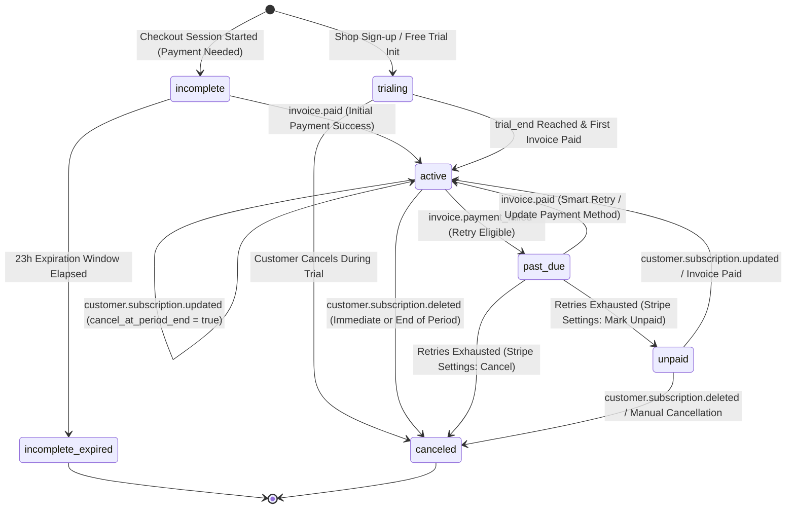

> [!NOTE]
> **BK-0 AUTHORITY NOTICE (2026-08-28):** Historical/implementation evidence only. Current product and production contract is governed by docs/DOCUMENTATION_INDEX.md and the numbered BK-0 SSOT. Preserve this file for evidence; do not treat older architecture, pricing, deployment or completion wording as current authority.

# Stripe Subscription State Machine & Webhook Integration Design

**Product:** Thai Local-Service Booking SaaS
**Stack:** Next.js 16 + Supabase (Schema: `local_service`)
**Billing Infrastructure:** Stripe Checkout + Customer Portal + Webhooks (Single Payment Provider Rule)
**Plans:** `free_trial`, `basic_490` (THB 490/mo), `pro_990` (THB 990/mo)

---

## Executive Summary

This design document defines the formal state machine, webhook event handling lifecycle, dual-source status synchronization strategy, business rules, and security pattern for subscription management in the `local_service` database schema.

---

## 1. Subscription State Machine

Stripe subscriptions move through seven distinct statuses as defined by the Stripe Billing API. The `local_service.subscriptions` table models these exact status strings via its `status` column check constraint.

### 1.1 State Definition Matrix

| Subscription Status (`subscriptions.status`) | Description | Allow New Bookings? | System Access Level |
| :--- | :--- | :---: | :--- |
| `trialing` | Active trial period without immediate charge. | **YES** | Full Access |
| `active` | Payment current and up to date. | **YES** | Full Access |
| `past_due` | Latest invoice payment failed; Stripe in automated retry sequence. | **YES** *(Grace Period)* | Full Access + Warning Banner |
| `canceled` | Subscription permanently terminated (by user, admin, or payment failure). | **NO** | Read-Only Dashboard |
| `incomplete` | Initial checkout started, payment authorization pending (23h window). | **NO** | Setup / Billing Portal Only |
| `incomplete_expired` | Initial checkout payment failed to complete within 23 hours. | **NO** | Billing Portal / Resubscribe Only |
| `unpaid` | All payment retries exhausted; subscription suspended until resolved. | **NO** | Billing Portal / Resubscribe Only |

---

### 1.2 State Transition Diagram



---

### 1.3 Transition Trigger Map

| Initial State | Target State | Triggering Stripe Webhook Event | Trigger Condition & Description |
| :--- | :--- | :--- | :--- |
| None | `trialing` | Internal DB Init / `checkout.session.completed` | Shop registers for free trial plan (`free_trial`). |
| None | `incomplete` | `checkout.session.completed` | Customer completes checkout requiring 3DS or delayed payment confirmation. |
| `incomplete` | `active` | `invoice.paid` | First invoice successfully settled. |
| `incomplete` | `incomplete_expired` | `customer.subscription.updated` / `.deleted` | Initial payment not completed within 23 hours; Stripe auto-expires subscription. |
| `trialing` | `active` | `invoice.paid` | Trial period completes and first billing cycle payment succeeds. |
| `trialing` | `canceled` | `customer.subscription.deleted` | Subscription canceled before trial converted to paid. |
| `active` | `past_due` | `invoice.payment_failed` | Recurring billing invoice attempt declines (insufficient funds, expired card). |
| `active` | `active` *(cancel scheduled)* | `customer.subscription.updated` | User clicks "Cancel Subscription" in Portal. `cancel_at_period_end` set to `true`. Status remains `active` until period end. |
| `active` | `canceled` | `customer.subscription.deleted` | Subscription reaches end of period after `cancel_at_period_end=true` OR canceled immediately via admin. |
| `past_due` | `active` | `invoice.paid` | Automated retry (Smart Retry) or customer manual card update resolves outstanding invoice. |
| `past_due` | `unpaid` | `customer.subscription.updated` | Stripe finishes retry schedule without success and marks subscription as unpaid. |
| `past_due` | `canceled` | `customer.subscription.deleted` | Stripe finishes retry schedule and automatically cancels subscription. |
| `unpaid` | `active` | `invoice.paid` / `customer.subscription.updated` | Overdue invoice paid via Portal. |
| `unpaid` | `canceled` | `customer.subscription.deleted` | Subscription permanently terminated. |

---

## 2. Stripe Webhook Handlers & Database Writes

The application must subscribe to five core Stripe webhook events. All database writes target the `local_service.subscriptions` table and propagate to `local_service.shops`.

### 2.1 Subscribed Webhook Events Summary

1. `checkout.session.completed`
2. `customer.subscription.updated`
3. `customer.subscription.deleted`
4. `invoice.paid`
5. `invoice.payment_failed`

---

### 2.2 Event Handler Specifications & DB Writes

#### 1. `checkout.session.completed`
- **Purpose:** Finalize initial subscription setup when a shop owner finishes Stripe Checkout.
- **Payload Extraction:**
  - `session.client_reference_id` or `session.metadata.shop_id` $\rightarrow$ `shop_id`
  - `session.customer` $\rightarrow$ `stripe_customer_id`
  - `session.subscription` $\rightarrow$ `stripe_subscription_id`
- **DB Write (UPSERT on `local_service.subscriptions`):**
  ```sql
  INSERT INTO local_service.subscriptions (
    shop_id,
    stripe_customer_id,
    stripe_subscription_id,
    plan,
    status,
    current_period_end,
    cancel_at_period_end,
    updated_at
  ) VALUES (
    :shop_id,
    :stripe_customer_id,
    :stripe_subscription_id,
    :plan, -- mapped from price_id (basic_490 / pro_990)
    :status, -- e.g. 'active' or 'trialing'
    to_timestamp(:current_period_end),
    :cancel_at_period_end,
    NOW()
  )
  ON CONFLICT (shop_id) DO UPDATE SET
    stripe_customer_id = EXCLUDED.stripe_customer_id,
    stripe_subscription_id = EXCLUDED.stripe_subscription_id,
    plan = EXCLUDED.plan,
    status = EXCLUDED.status,
    current_period_end = EXCLUDED.current_period_end,
    cancel_at_period_end = EXCLUDED.cancel_at_period_end,
    updated_at = NOW();
  ```

#### 2. `customer.subscription.updated`
- **Purpose:** Reflect plan upgrades/downgrades, billing period extensions, `cancel_at_period_end` toggle changes, and status transitions.
- **Payload Extraction:**
  - `subscription.id` $\rightarrow$ `stripe_subscription_id`
  - `subscription.items.data[0].price.id` $\rightarrow$ Map to `plan` (`basic_490` | `pro_990`)
  - `subscription.status` $\rightarrow$ `status`
  - `subscription.current_period_end` $\rightarrow$ `current_period_end`
  - `subscription.cancel_at_period_end` $\rightarrow$ `cancel_at_period_end`
- **DB Write (UPDATE on `local_service.subscriptions`):**
  ```sql
  UPDATE local_service.subscriptions
  SET
    plan = :plan,
    status = :status,
    current_period_end = to_timestamp(:current_period_end),
    cancel_at_period_end = :cancel_at_period_end,
    updated_at = NOW()
  WHERE stripe_subscription_id = :stripe_subscription_id;
  ```

#### 3. `customer.subscription.deleted`
- **Purpose:** Handle subscription termination (end-of-term after cancellation, or immediate cancellation).
- **Payload Extraction:**
  - `subscription.id` $\rightarrow$ `stripe_subscription_id`
- **DB Write (UPDATE on `local_service.subscriptions`):**
  ```sql
  UPDATE local_service.subscriptions
  SET
    status = 'canceled',
    cancel_at_period_end = false,
    updated_at = NOW()
  WHERE stripe_subscription_id = :stripe_subscription_id;
  ```

#### 4. `invoice.paid`
- **Purpose:** Confirm recurring billing success and extend billing period.
- **Payload Extraction:**
  - `invoice.subscription` $\rightarrow$ `stripe_subscription_id`
  - Fetch latest `current_period_end` from embedded invoice line item or fetch subscription object.
- **DB Write (UPDATE on `local_service.subscriptions`):**
  ```sql
  UPDATE local_service.subscriptions
  SET
    status = 'active',
    current_period_end = to_timestamp(:current_period_end),
    updated_at = NOW()
  WHERE stripe_subscription_id = :stripe_subscription_id;
  ```

#### 5. `invoice.payment_failed`
- **Purpose:** Record billing failure and shift subscription into `past_due`.
- **Payload Extraction:**
  - `invoice.subscription` $\rightarrow$ `stripe_subscription_id`
  - `invoice.attempt_count`
- **DB Write (UPDATE on `local_service.subscriptions`):**
  ```sql
  UPDATE local_service.subscriptions
  SET
    status = 'past_due',
    updated_at = NOW()
  WHERE stripe_subscription_id = :stripe_subscription_id;
  ```

---

## 3. Dual Source of Truth Reconciliation Strategy

### 3.1 Decision & Recommendation

**Recommendation:** **Synchronized Derived Column Strategy with Phased Read Migration.**

We will maintain `local_service.subscriptions.status` as the **Single Source of Truth (SSOT)** for all subscription logic. The legacy column `local_service.shops.subscription_status` will be updated synchronously by the webhook handler during every subscription DB write transaction (Sync-on-Write).

### 3.2 Rationale

1. **Zero Downtime / Zero Regression Risk:** Existing critical paths (booking engine availability checks, dashboard layout components, staff access control) currently query `shops.subscription_status`. Attempting a high-risk refactor to rewrite all queries across the Next.js app in one go introduces potential booking breakage.
2. **Deterministic Sync:** By updating `shops.subscription_status` within the exact same database transaction / helper function that writes `subscriptions.status`, two sources of truth never drift out of sync.
3. **Clean Deprecation Path:** `shops.subscription_status` becomes a simple materialized view column on `shops`. Once all application read queries are updated to join `local_service.subscriptions`, `shops.subscription_status` can be safely dropped in a future migration.

### 3.3 Status Mapping Matrix

The legacy column `shops.subscription_status` has simplified string values (`trial`, `active`, `past_due`, `canceled`). The webhook sync layer maps the granular Stripe statuses to `shops.subscription_status` as follows:

| Granular `subscriptions.status` | Legacy `shops.subscription_status` Value | Note |
| :--- | :--- | :--- |
| `trialing` | `'trial'` | Initial free trial or Stripe trial period. |
| `active` | `'active'` | Full operational status. |
| `past_due` | `'past_due'` | Triggers grace period logic in booking engine. |
| `canceled` | `'canceled'` | Blocks public booking page. |
| `incomplete` | `'inactive'` | Prevents shop launch until first payment clears. |
| `incomplete_expired` | `'canceled'` | Requires restarting checkout. |
| `unpaid` | `'canceled'` | Exhausted retries; access suspended. |

### 3.4 Synchronized Write Atomic Pattern

Every webhook handler operation invokes a unified database transaction:

```sql
BEGIN;

-- 1. Write to SSOT Table
UPDATE local_service.subscriptions
SET status = :new_status, plan = :new_plan, current_period_end = :new_period_end, updated_at = NOW()
WHERE stripe_subscription_id = :stripe_subscription_id
RETURNING shop_id;

-- 2. Sync to Legacy Column
UPDATE local_service.shops
SET subscription_status = :legacy_status, updated_at = NOW()
WHERE id = :shop_id;

COMMIT;
```

---

## 4. Business Rules & Edge Cases

### 4.1 Booking Acceptance Rules Matrix

The table below details how each subscription state impacts a shop's ability to accept **new online customer bookings**:

| Subscription Status | Allow New Bookings? | Grace Period | User Interface & Operational Behavior |
| :--- | :---: | :---: | :--- |
| `active` | **YES** | N/A | Normal operations. Full access to admin dashboard and public booking page. |
| `trialing` | **YES** | N/A | Free trial mode. Full booking access. Trial expiration banner shown in dashboard. |
| `cancel_at_period_end = true` *(status='active')* | **YES** | Until `current_period_end` | **Fully operational.** The shop has paid for the current billing cycle. Bookings remain enabled. Banner alerts shop owner: *"Your subscription will end on [Date]."*" |
| `past_due` | **YES** | **7-Day Grace Period** | **Bookings stay open during 7-day grace period.** Stripe Smart Retries run in background. Dashboard displays urgent warning: *"Payment failed. Please update credit card to avoid booking suspension."* If unresolved after 7 days, bookings freeze. |
| `incomplete` | **NO** | None | Public booking page disabled. Dashboard displays checkout completion modal. |
| `incomplete_expired` | **NO** | None | Public booking page disabled. Shop must select a plan and complete checkout again. |
| `unpaid` | **NO** | None | **Bookings suspended immediately.** Dashboard locked to Customer Portal redirect screen. |
| `canceled` | **NO** | None | **Bookings suspended immediately.** Public booking page displays: *"This shop is currently not accepting online bookings."* Dashboard remains accessible in read-only mode for historical reports. |

---

### 4.2 Handling `cancel_at_period_end = true`

When a shop owner clicks "Cancel Subscription" inside the Stripe Customer Portal:
1. Stripe updates the subscription object: `status` remains `'active'`, but `cancel_at_period_end` becomes `true`.
2. Stripe sends a `customer.subscription.updated` webhook.
3. **Database Action:** Update `local_service.subscriptions.cancel_at_period_end = true` and `status = 'active'`.
4. **Business Effect:**
   - **Do NOT disable bookings.** The shop has already paid for the current period ending at `current_period_end`.
   - `shops.subscription_status` remains `'active'`.
   - Public booking page continues to allow customer appointments.
5. **Final Cutoff:** When `current_period_end` is reached, Stripe triggers `customer.subscription.deleted`. This event updates `status = 'canceled'` and `shops.subscription_status = 'canceled'`, which immediately turns off new booking acceptance.

---

### 4.3 Webhook Idempotency Strategy

Stripe guarantees **at-least-once delivery** of webhooks. Network retries or concurrent deliveries can cause duplicate webhook events to arrive at the Next.js API endpoint.

#### 1. Idempotency Table Schema
To ensure every event is processed exactly once, create an idempotency log table in Supabase:

```sql
CREATE TABLE local_service.stripe_webhook_events (
  id text PRIMARY KEY, -- Stripe Event ID (e.g., 'evt_3M1234567890')
  type text NOT NULL,
  created_at timestamptz NOT NULL,
  processed_at timestamptz NOT NULL DEFAULT NOW()
);
```

#### 2. Atomic Processing Algorithm

```
                  ┌──────────────────────────────┐
                  │ Webhook Received (evt_123...)│
                  └──────────────┬───────────────┘
                                 │
                 ┌───────────────▼───────────────┐
                 │ Insert into                   │
                 │ stripe_webhook_events(id)     │
                 └───────────────┬───────────────┘
                                 │
                     / \        │
                    /   \       │
     Primary Key   /     \      │ Insert Succeeded
      Conflict?   <  Yes  >     │ (First Time)
                   \     /      │
                    \   /       │
                     \ /        │
                      │         │
            ┌─────────▼──────┐  │
            │ Return HTTP 200│  │
            │ {"duplicate"}  │  │
            └────────────────┘  │
                                │
                 ┌──────────────▼───────────────┐
                 │ Parse & Validate Event Timestamp│
                 └──────────────┬───────────────┘
                                │
                 ┌──────────────▼───────────────┐
                 │ Execute DB Update Transaction │
                 └──────────────┬───────────────┘
                                │
                 ┌──────────────▼───────────────┐
                 │ Return HTTP 200 {"ok": true} │
                 └──────────────────────────────┘
```

1. Extract `event.id` (e.g., `evt_1N...`).
2. Execute atomic SQL insert: `INSERT INTO local_service.stripe_webhook_events (id, type, created_at) VALUES (:id, :type, :created_at) ON CONFLICT (id) DO NOTHING RETURNING id;`
3. If no row returned (duplicate event), log notice and immediately return `HTTP 200 OK` (`{"received": true, "duplicate": true}`).
4. **Out-of-Order Timestamp Guard:** Before updating `local_service.subscriptions`, verify that `event.created` (converted to timestamptz) is greater than or equal to `subscriptions.updated_at`. If `event.created` is older than `updated_at`, ignore state changes to prevent stale webhooks from overwriting newer DB states.

---

## 5. Webhook Security & Request Payload Trust

The webhook handler API route (`/api/webhooks/stripe`) MUST NOT trust any incoming request body or headers without strict cryptographic signature verification. Following the project's security precedent set by the LINE OA webhook handler (which utilizes `HMAC-SHA256` with `crypto.timingSafeEqual` in a server-only context), the Stripe handler must verify Stripe signatures using `stripe.webhooks.constructEvent(rawBody, signatureHeader, endpointSecret)` using the raw unparsed request payload buffer. The raw request body must be read directly before any JSON parsing, matched against the `stripe-signature` header using the secret stored securely in environment variable `STRIPE_WEBHOOK_SECRET`. This guarantees that event payloads originate strictly from Stripe's official IP ranges, preventing payload tampering, replay attacks, or unauthorized subscription status mutations.
